# Theme Preferences

**Theme Preferences** is an extension for [Aseprite](https://www.aseprite.org/) that allows for customizing the theme inside the editor.

## How to use the extension

After installing the extension and restarting Aseprite a new option for Theme Preferences… will appear in the View menu.

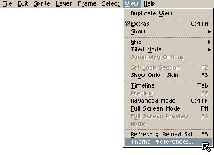

Clicking it will open the Theme Preferences that allow you to directly change the colors of the UI elements.

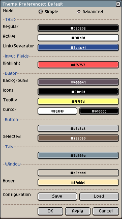

## Warning

Theme Preferences needs access to PNG and XML templates in its own folder in order to customize the theme. Aseprite will prompt you for explicit permission for an extension to access files.

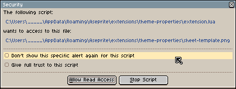

If you don’t feel safe with that you can deny the request and block the script.

## Saving and Loading Configuration

Your Theme Preferences can be saved and loaded from this window.

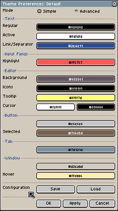

## Importing and Exporting Configuration

Your Theme Preferences can be exported into plain text, and web-safe code for backup and sharing with others.

Codes can be imported by opening the Load window and clicking the Import button. Any saved configuration has an Export button that generates the code.

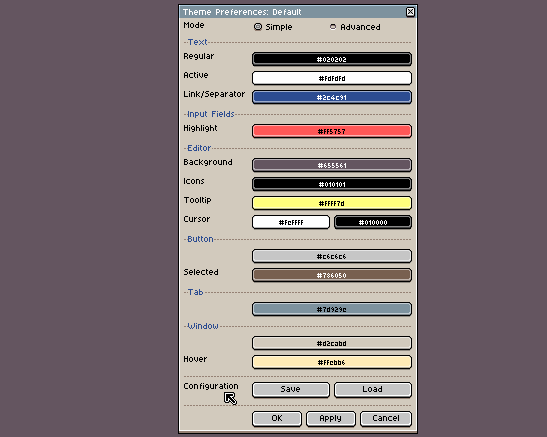

## Previews

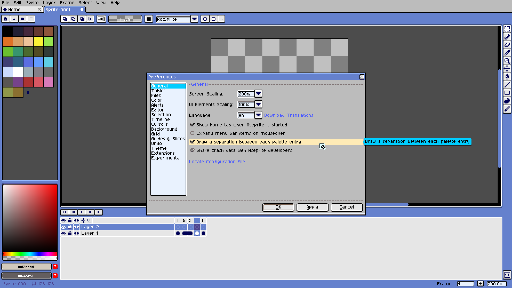
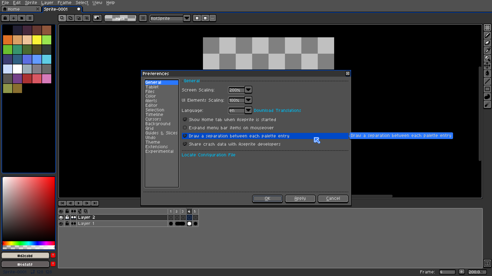
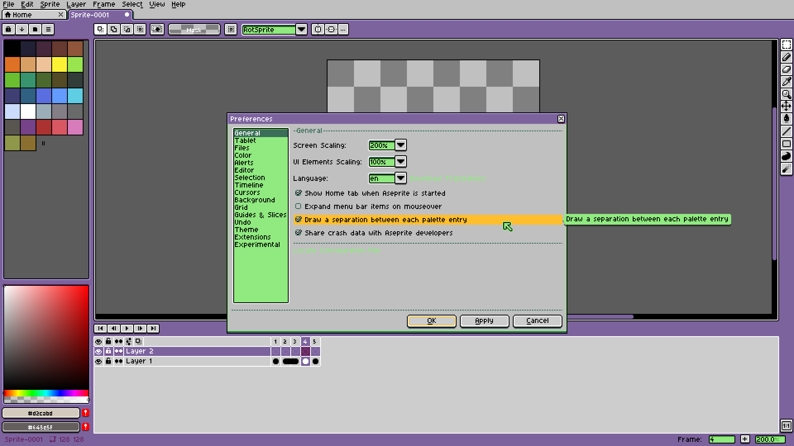
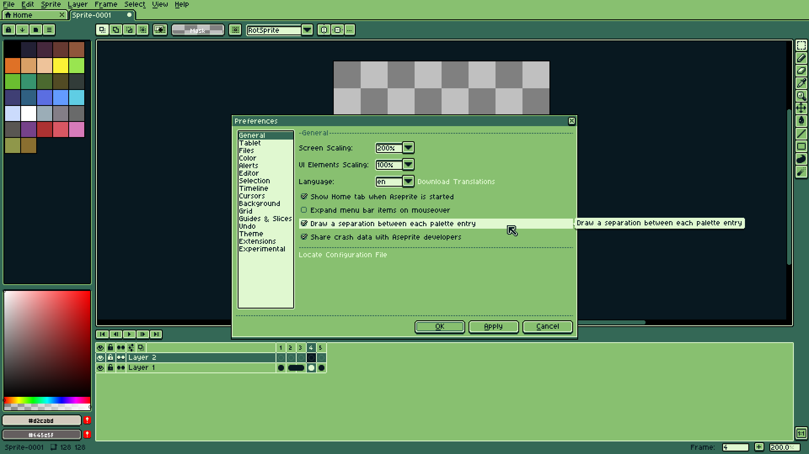
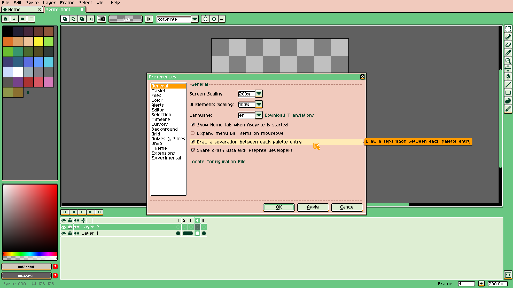
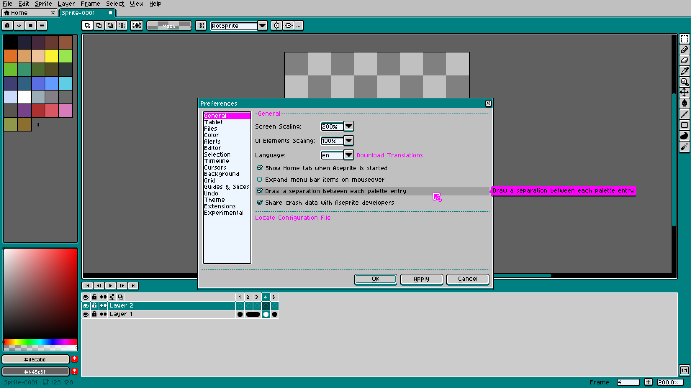
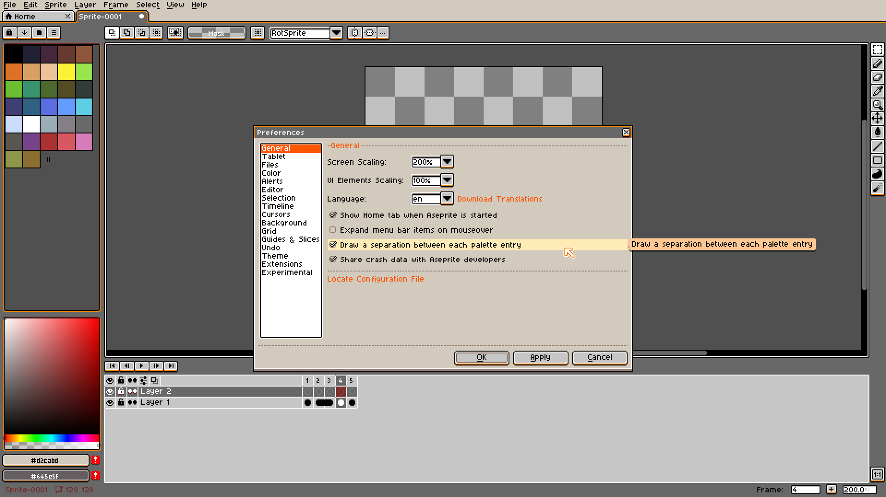
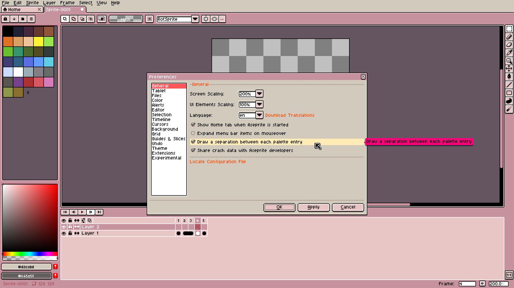
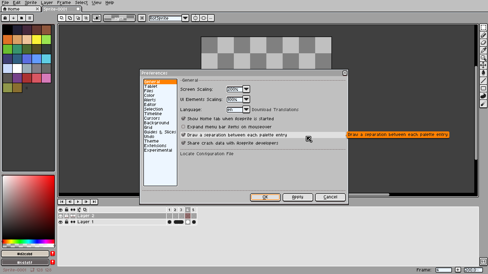
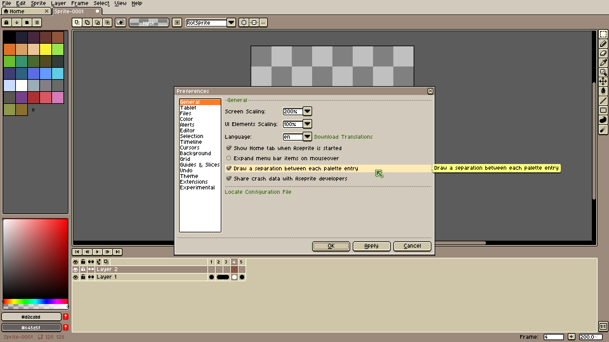
